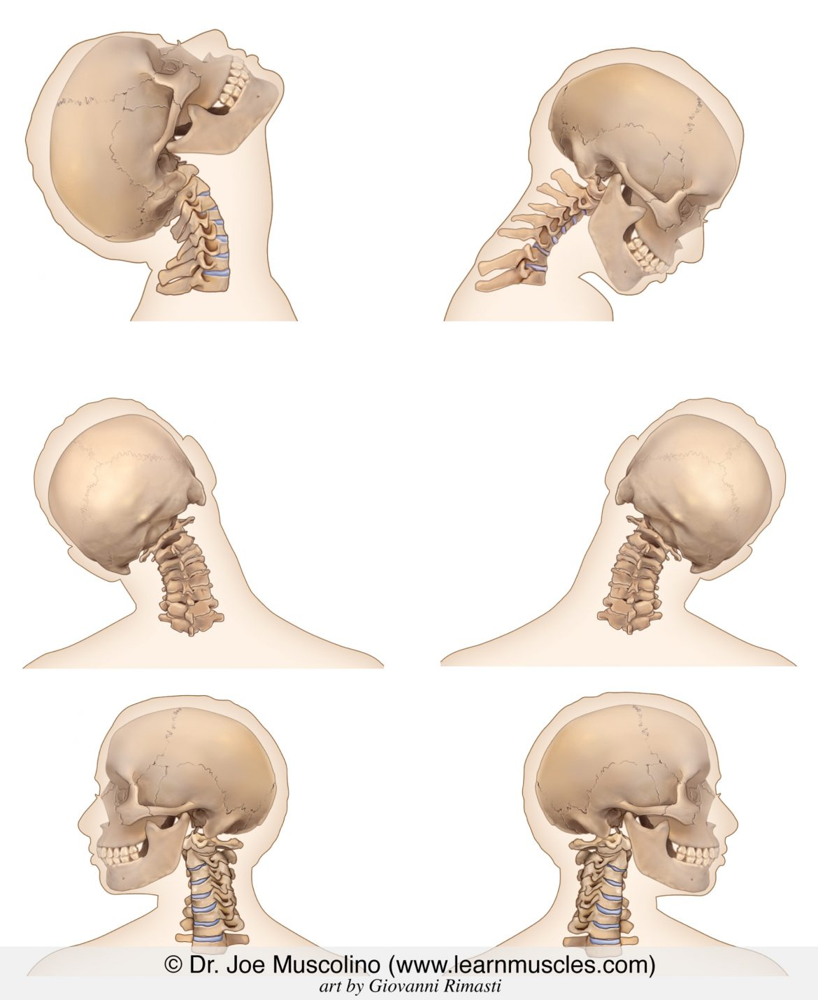

# rotate-sphere
=============

Rotation of a sphere drawn on canvas.
Can be tested here: http://jsfiddle.net/refikt/q3ek7p4e/

Why?: https://medium.com/@refik/a-journey-and-a-method-for-drawing-spheres-5b24246ca479

Refik Turkeli

## basic physics terms:
- Rotation around the front-to-back axis is called roll. (ie 1st slider)
- Rotation around the side-to-side axis is called pitch. (ie 3rd slider)
- Rotation around the vertical axis is called yaw. (ie 2nd slider)

## range of motion of cervical spine:

The average number of degrees of motion that the cervical (cervicocranial – head and neck) spine can move is:
- Flexion: 50 degrees
- Extension:  80 degrees
- Right Lateral Flexion: 45 degrees
- Left Lateral Flexion: 45 degrees
- Right Rotation: 80 degrees
- Left Rotation: 80 degrees

credit: Permission: Dr. Joe Muscolino. www.learnmuscles.com

https://learnmuscles.com/glossary/cervical-spine-ranges-of-motion-rom/